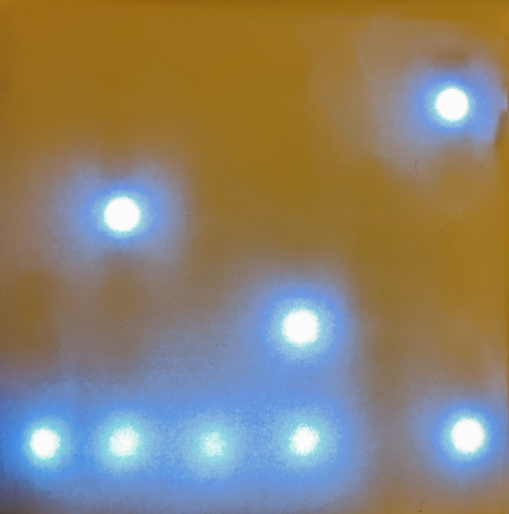

> Binary Coded Decimal LED clock
>
> December 2019
>
> [https://github.com/pmusgrave/binary-clock](https://github.com/pmusgrave/binary-clock)

This is just a really quick project I threw together to test out some hardware I picked up. I got some I2C based real time clock modules and strips of individually addressable LED lights for relatively cheap and this is a good project to utilize both of those. I had worked with LED strips [before](/led-driver), but I had never used individually addressable lights.

I used an Arduino Uno, and a few really handy libraries to implement the RTC communication and LED driver -- the Adafruit DS3231 Sensor library to talk to the RTC, and the FastLED library to drive the Neopixel LED strips.

I cut 6 strips of 4 LEDs, wired in series, so there are two strips for each portion of the clock display: HH:MM:SS. Each column represents one BCD digit of the current time. 4 LEDs are needed per digit so that the numbers 0-9 can be displayed as 0000-1001.

Regular printer paper is used to cover the LEDs. This serves both to diffuse the LEDs and dampen the brightness.

