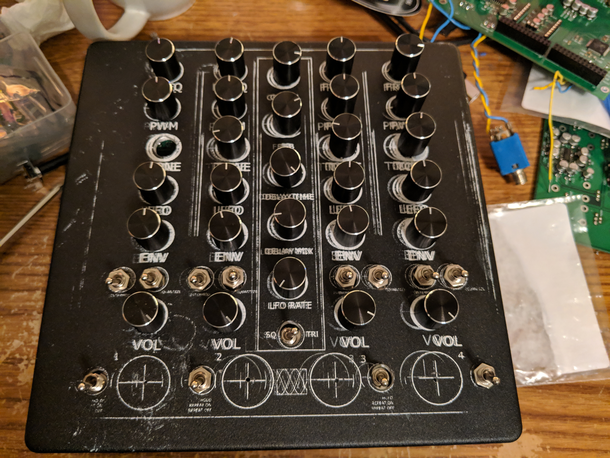

> A four voice polyphonic exerimental drone synthesizer
>
> January 2018 - April 2018
>
> private repository

This was my first hardware synthesizer, with a fairly basic timer-based sound generator approach. Using an ARM core microcontroller, I was able to get four voice polyphonic square wave output with PWM, low pass filter per channel, low frequency oscillator, a PT2399 delay module, and MIDI in and out. Each channel can either be held on in a drone mode, or can be triggered with an envelope by a capacitive touch button. Each channel also has a frequency control potentiometer, which can either be swept continuously or quantized to standard equal tempered note frequencies. The most surprising thing about this project was that no one had done it yet. I would expect there to be lots of products on the markets that use timer/PWM peripherals for square wave generators at audio frequencies considering how cheap and easy it is, but it doesn't seem to be a common approach.