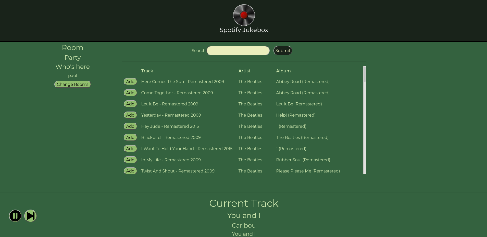

> A web app to synchronize playback between multiple Spotify accounts!
>
> On and off between October 2017 through April 2018
>
> [https://github.com/pmusgrave/SpotifyJukebox](https://github.com/pmusgrave/SpotifyJukebox)

The idea for this project had been milling around in various forms for quite some time, but I eventually settled on a single page web app to achieve the desired functionality. Initially, I was trying to solve the annoyance of having multiple people pair their phones with a bluetooth speaker. If you've ever tried to unpair one phone and pair another one, you probably know what I'm talking about. Particularly when you're playing music at a party or wherever, stopping the music to mess with technology ruins the mood and ruins the flow. It takes entirely too much time for the task you're trying to do. Initially, I thought about making some kind of hardware box that paired with multiple phones and allowed the user to switch the audio output. That way, everyone's phone would be paired continuously, and you could switch the audio output instantaneously. However, I didn't pursue this approach very far because it's expensive for one thing, and it doesn't scale very well for another. You would need separate bluetooth receiver hardware to support the desired number of users. If you want to add more users, you would need to add more hardware, which means you're either stuck, or back to the same situation where you have to unpair one phone and pair another one. And you would also need to pair everyone's phones initially, which is too much setup work.

At the root of the issue is that multiple people often like to control the music. People have different tastes and like to share the music they're into. All you really need is a straightforward way to change who is in control of the song that's currently playing. Then it hit me! Jukeboxes solved this problem a long time ago! With this web app, multiple users can search and add songs to a shared group playlist. Just like a jukebox.

There are a few different ways that might work. I think there are two main uses cases for this app. The first one is the scenario I just described where everyone's in the same room. One account serves as a master device that connects to the speaker system. Everyone in the room can search for songs on Spotify and add them to a shared playlist, which is just a simple queue.

The other really exciting use case is when people *aren't* in the same room. You can synchronize your music playlist with anyone in the world. In that case, everyone connects to the web app, searches for songs and adds them to the shared playlist, but now the songs play back on everyone's spotify account in unison.

The only caveat is that the Spotify API only works with Spotify Premium accounts.



